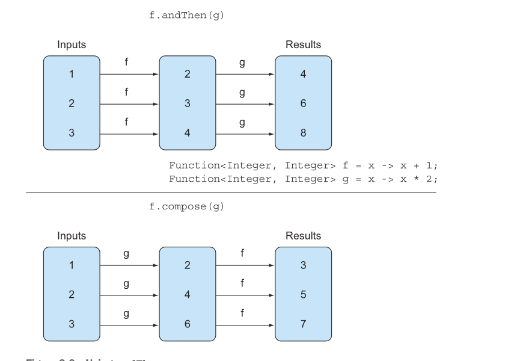

# Guia Completo - Lambda Expressions em Java 8

## 1. Introdução às Lambda Expressions

### 1.1 Lambdas em Resumo

Uma expressão lambda pode ser entendida como uma representação concisa de uma function anônima que pode ser passada por aí. Ela não tem um nome, mas tem uma lista de parâmetros, um corpo, um tipo de retorno, e também possivelmente uma lista de exceptions que podem ser lançadas.

#### Características das Lambda Expressions:

- **Anônima** — Não tem um nome explícito como um method normalmente teria; menos para escrever e pensar!
- **Function** — Uma lambda não está associada com uma classe particular como um method está. Mas como um method, uma lambda tem uma lista de parâmetros, um corpo, um tipo de retorno, e uma possível lista de exceptions que podem ser lançadas.
- **Passed around** — Uma expressão lambda pode ser passada como argumento para um method ou armazenada em uma variável.
- **Concisa** — Você não precisa escrever muito boilerplate como você faz para anonymous classes.

### 1.2 Comparação: Anonymous Classes vs Lambda Expressions

#### Classes Anônimas:
```java
Comparator<Apple> byWeight = new Comparator<Apple>() {
    public int compare(Apple a1, Apple a2){
        return a1.getWeight().compareTo(a2.getWeight());
    }
};
```

#### Lambda Expressions:
```java
Comparator<Apple> byWeight =
    (Apple a1, Apple a2) -> a1.getWeight().compareTo(a2.getWeight());
```

### 1.3 Estrutura das Lambda Expressions

Lambda expressions são formadas por três partes:

1. **Lista de parâmetros**: Pode ser vazia, conter um único parâmetro sem parênteses, ou múltiplos parâmetros entre parênteses.
2. **Operador de seta**: `->` separa a lista de parâmetros do corpo
3. **Corpo da expressão**: Pode ser uma única expressão ou um bloco de código entre chaves.

---

## 2. Functional Interfaces

### 2.1 Conceito

Em resumo, uma functional interface é uma interface que especifica exatamente um método abstrato.

### 2.2 Exemplo Prático

```java
Runnable r1 = () -> System.out.println("Hello World 1"); // Uses a lambda

Runnable r2 = new Runnable() { // Uses an anonymous class
    public void run() {
        System.out.println("Hello World 2");
    }
};

public static void process(Runnable r) {
    r.run();
}

process(r1); // Prints "Hello World 1"
process(r2); // Prints "Hello World 2"
process(() -> System.out.println("Hello World 3")); // Prints "Hello World 3" with a lambda passed directly
```

### 2.3 Function Descriptor

> "Para métodos void, você pode omitir as chaves quando há apenas uma linha de código"

#### Exemplos de Validação:

```java
// 1. ✅ VÁLIDA
execute(() -> {});
// () -> void combina com Runnable

// 2. ✅ VÁLIDA
public Callable<String> fetch() {
    return () -> "Tricky example ;-)";
}
// () -> String combina com Callable<String>

// 3. ❌ INVÁLIDA
Predicate<Apple> p = (Apple a) -> a.getWeight();
// (Apple) -> Integer NÃO combina com (Apple) -> boolean
```

### 2.4 Como Lambda se Conecta com Interface Funcional

#### A Mágica:
**Se uma interface tem só 1 método, o Java "sabe" qual método você quer implementar quando usa lambda!**

```java
// Em vez de escrever tudo isso:
ApplePredicate predicate = new ApplePredicate() {
    public boolean test(Apple apple) {
        return "red".equals(apple.getColor());
    }
};

// Você pode escrever só isso:
ApplePredicate predicate = apple -> "red".equals(apple.getColor());
```

---

## 3. Execute-Around Pattern

### 3.1 Conceito e Implementação

```java
import java.io.*;

// Interface funcional
@FunctionalInterface
public interface BufferedReaderProcessor {
    String process(BufferedReader b) throws IOException;
}

// Método que executa o comportamento
public static String processFile(BufferedReaderProcessor p) throws IOException {
    try (BufferedReader br = new BufferedReader(new FileReader("data.txt"))) {
        return p.process(br);
    }
}

// Exemplos de chamada
String oneLine = processFile((BufferedReader br) -> br.readLine());
String twoLines = processFile((BufferedReader br) -> br.readLine() + br.readLine());
```

---

## 4. Principais Functional Interfaces

### 4.1 Predicate<T>

A interface `java.util.function.Predicate<T>` define um método abstrato chamado `test` que aceita um objeto de tipo genérico T e retorna um boolean.

```java
public <T> List<T> filter(List<T> list, Predicate<T> p) {
    List<T> results = new ArrayList<>();
    for(T t: list) {
        if(p.test(t)) {
            results.add(t);
        }
    }
    return results;
}
```

### 4.2 Consumer<T>

A interface `java.util.function.Consumer<T>` define um método abstrato chamado `accept` que recebe um objeto de tipo genérico T e não retorna resultado (void).

```java
@FunctionalInterface
public interface Consumer<T> {
    void accept(T t);
}

public <T> void forEach(List<T> list, Consumer<T> c) {
    for(T t: list) {
        c.accept(t);
    }
}

forEach(
    Arrays.asList(1,2,3,4,5),
    (Integer i) -> System.out.println(i)
);
```

### 4.3 Function<T, R>

A interface `java.util.function.Function<T, R>` define um método abstrato chamado `apply` que recebe um objeto de tipo genérico T como entrada e retorna um objeto de tipo genérico R.

```java
@FunctionalInterface
public interface Function<T, R> {
    R apply(T t);
}

public <T, R> List<R> map(List<T> list, Function<T, R> f) {
    List<R> result = new ArrayList<>();
    for(T t: list) {
        result.add(f.apply(t));
    }
    return result;
}

// [7, 2, 6]
List<Integer> l = map(
    Arrays.asList("lambdas", "in", "action"),
    (String s) -> s.length()
);
```

---

## 5. Primitive Specializations

### 5.1 O Problema e a Solução

#### O Problema:
```java
// ❌ LENTO - boxing/unboxing
Predicate<Integer> isEven = n -> n % 2 == 0;
isEven.test(1000); // int vira Integer (boxing)
```

#### A Solução:
```java
// ✅ RÁPIDO - sem boxing
IntPredicate isEven = n -> n % 2 == 0;
isEven.test(1000); // trabalha direto com int
```

### 5.2 Principais Interfaces Especializadas

| Genérica | Especializada | Exemplo |
|----------|---------------|---------|
| `Predicate<Integer>` | `IntPredicate` | `n -> n > 0` |
| `Consumer<Integer>` | `IntConsumer` | `n -> System.out.println(n)` |
| `Function<T, Integer>` | `ToIntFunction<T>` | `s -> s.length()` |
| `Function<Integer, R>` | `IntFunction<R>` | `n -> "Number: " + n` |
| `UnaryOperator<Integer>` | `IntUnaryOperator` | `n -> n * 2` |

### 5.3 Regra Simples
**Se trabalha muito com `int`, `long`, `double` → use as versões especializadas para performance!**

---

## 6. Tabela de Casos de Uso - Functional Interfaces

| **Caso de Uso** | **Exemplo de Lambda** | **Interface Funcional** |
|-----------------|----------------------|-------------------------|
| **Expressão booleana** | `(List<String> list) -> list.isEmpty()` | `Predicate<List<String>>` |
| **Criar objetos** | `() -> new Apple(10)` | `Supplier<Apple>` |
| **Consumir de um objeto** | `(Apple a) -> System.out.println(a.getWeight())` | `Consumer<Apple>` |
| **Selecionar/extrair de um objeto** | `(String s) -> s.length()` | `Function<String, Integer>` |
| **Combinar dois valores** | `(int a, int b) -> a * b` | `IntBinaryOperator` |
| **Comparar dois objetos** | `(Apple a1, Apple a2) -> a1.getWeight().compareTo(a2.getWeight())` | `Comparator<Apple>` |
| **Transformar mesmo tipo** | `(String s) -> s.toUpperCase()` | `UnaryOperator<String>` |
| **Processar dois tipos diferentes** | `(String name, Integer age) -> name + " is " + age` | `BiFunction<String, Integer, String>` |

### 6.1 Resumo por Categoria

#### 🔍 **Testagem/Filtragem**
- `Predicate<T>` → `(T) -> boolean`
- `BiPredicate<T, U>` → `(T, U) -> boolean`

#### 🏭 **Criação/Fornecimento**
- `Supplier<T>` → `() -> T`

#### ⚡ **Execução/Consumo**
- `Consumer<T>` → `(T) -> void`
- `BiConsumer<T, U>` → `(T, U) -> void`

#### 🔄 **Transformação**
- `Function<T, R>` → `(T) -> R`
- `BiFunction<T, U, R>` → `(T, U) -> R`
- `UnaryOperator<T>` → `(T) -> T`
- `BinaryOperator<T>` → `(T, T) -> T`

---

## 7. Method References

### 7.1 Conceito

Method references podem ser vistas como uma forma abreviada para lambdas que chamam apenas um método específico.

### 7.2 Tabela de Equivalência

| **Lambda** | **Method Reference Equivalente** |
|------------|----------------------------------|
| `(Apple apple) -> apple.getWeight()` | `Apple::getWeight` |
| `() -> Thread.currentThread().dumpStack()` | `Thread.currentThread()::dumpStack` |
| `(str, i) -> str.substring(i)` | `String::substring` |
| `(String s) -> System.out.println(s)` | `System.out::println` |
| `(String s) -> this.isValidName(s)` | `this::isValidName` |

### 7.3 Tipos de Method References

#### 7.3.1 Method Reference para Método Estático
```java
// Exemplo: Integer::parseInt
Integer::parseInt
```

#### 7.3.2 Method Reference para Método de Instância de um Tipo Arbitrário
```java
// Exemplo: String::length
String::length
```

#### 7.3.3 Method Reference para Método de Instância de um Objeto Existente
```java
// Exemplo: expensiveTransaction::getValue
expensiveTransaction::getValue
```

### 7.4 Constructor References

#### Exemplo com um parâmetro:
```java
List<Integer> weights = Arrays.asList(7, 3, 4, 10);
List<Apple> apples = map(weights, Apple::new);

public List<Apple> map(List<Integer> list, Function<Integer, Apple> f) {
    List<Apple> result = new ArrayList<>();
    for(Integer i: list) {
        result.add(f.apply(i));
    }
    return result;
}
```

#### Exemplo com dois parâmetros:
```java
List<Apple> apples = map(weights, Apple::new, "green");

public List<Apple> map(List<Integer> list, BiFunction<Integer, String, Apple> f, String color) {
    List<Apple> result = new ArrayList<>();
    for(Integer i: list) {
        result.add(f.apply(i, color));
    }
    return result;
}
```

---

## 8. Aplicação Prática: Evolução de Código

### 8.1 Step 1: Pass Code (Classe como Parâmetro)

```java
public class AppleComparator implements Comparator<Apple> {
    public int compare(Apple a1, Apple a2){
        return a1.getWeight().compareTo(a2.getWeight());
    }
}
inventory.sort(new AppleComparator());
```

### 8.2 Step 2: Use Anonymous Class

```java
inventory.sort(new Comparator<Apple>() {
    public int compare(Apple a1, Apple a2){
        return a1.getWeight().compareTo(a2.getWeight());
    }
});
```

### 8.3 Step 3: Use Lambda Expression

```java
import static java.util.Comparator.comparing;

inventory.sort(comparing(apple -> apple.getWeight()));
```

### 8.4 Step 4: Use Method Reference

```java
import static java.util.Comparator.comparing;
inventory.sort(comparing(Apple::getWeight));
```

---

## 9. Composição de Lambda Expressions

### 9.1 Chaining Comparators

```java
inventory.sort(comparing(Apple::getWeight)
    .reversed()
    .thenComparing(Apple::getCountry));
```

### 9.2 Composing Predicates

```java
Predicate<Apple> notRedApple = redApple.negate();

Predicate<Apple> redAndHeavyApple =
    redApple.and(apple -> apple.getWeight() > 150);

Predicate<Apple> redAndHeavyAppleOrGreen =
    redApple.and(apple -> apple.getWeight() > 150)
        .or(apple -> GREEN.equals(a.getColor()));
```

> **Precedência**: a.or(b).and(c) = (a || b) && c e a.and(b).or(c) = (a && b) || c

### 9.3 Composing Functions

#### andThen:
```java
Function<Integer, Integer> f = x -> x + 1;
Function<Integer, Integer> g = x -> x * 2;
Function<Integer, Integer> h = f.andThen(g);
int result = h.apply(1); // Resultado: 4
```

#### compose:
```java
Function<Integer, Integer> f = x -> x + 1;
Function<Integer, Integer> g = x -> x * 2;
Function<Integer, Integer> h = f.compose(g);
int result = h.apply(1); // Resultado: 3
```

#### Diferença entre andThen e compose:



- **andThen**: `f.andThen(g)` = "Faça f **E ENTÃO** faça g"
- **compose**: `f.compose(g)` = "Para fazer f, primeiro **COMPONHA** com g"

---

## 10. Resumo Final

• Uma expressão lambda pode ser entendida como um tipo de function anônima: ela não tem um nome, mas tem uma lista de parâmetros, um corpo, um tipo de retorno, e também possivelmente uma lista de exceptions que podem ser lançadas.

• Expressões lambda permitem que você passe código de forma concisa.

• Uma functional interface é uma interface que declara exatamente um método abstrato.

• Expressões lambda podem ser usadas apenas onde uma functional interface é esperada.

• Expressões lambda permitem que você forneça a implementação do método abstrato de uma functional interface diretamente inline e trate toda a expressão como uma instância de uma functional interface.

• O Java 8 vem com uma lista de functional interfaces comuns no pacote java.util.function, que inclui Predicate<T>, Function<T, R>, Supplier<T>, Consumer<T>, e BinaryOperator<T>.

• Especializações primitivas de functional interfaces genéricas comuns como Predicate<T> e Function<T, R> podem ser usadas para evitar operações de boxing: IntPredicate, IntToLongFunction, e assim por diante.

• O padrão execute-around pode ser usado com lambdas para ganhar flexibilidade e reutilização adicionais.

• O tipo esperado para uma expressão lambda é chamado de target type.

• Method references permitem que você reutilize uma implementação de method existente e a passe diretamente.

• Functional interfaces como Comparator, Predicate, e Function têm vários default methods que podem ser usados para combinar expressões lambda.

---

*Este guia completo demonstra como as lambda expressions revolucionaram a programação Java, tornando o código mais conciso, legível e funcional.*
