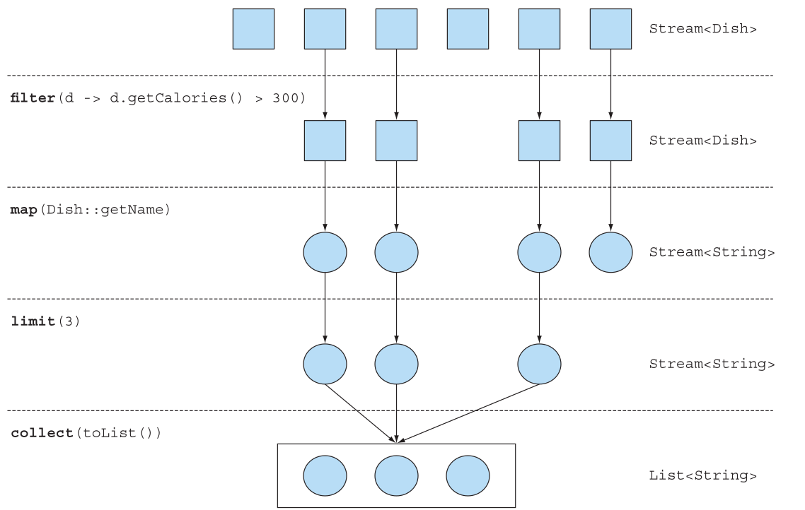
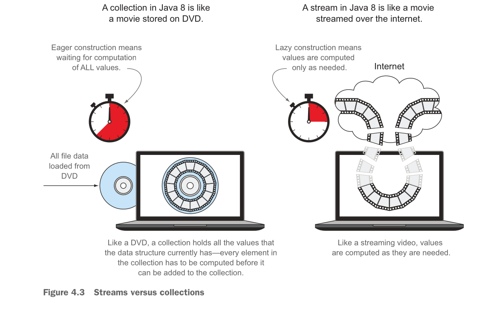
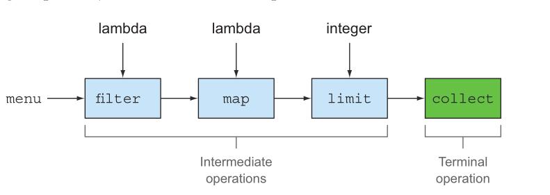

# Guia Completo - Introducing Streams

## 📋 Resumo Executivo

### Principais Conceitos:
- **what is streaming?**
- **Collections versus streams**
- **Internal versus external iteration**
- **Intermediate versus terminal operations**

### ⚡ Resumo Rápido - Streams

• Uma stream é uma sequência de elementos de uma fonte que suporta operações de processamento de dados.

• Streams fazem uso de iteração interna: a iteração é abstraída através de operações como filter, map, e sorted.

• Existem dois tipos de operações de stream: operações intermediárias e terminais.

• Operações intermediárias como filter e map retornam uma stream e podem ser encadeadas. Elas são usadas para configurar um pipeline de operações mas não produzem nenhum resultado.

• Operações terminais como forEach e count retornam um valor que não é stream e processam um pipeline de stream para retornar um resultado.

• Os elementos de uma stream são computados sob demanda ("preguiçosamente").

### 🎯 Benefícios das Streams:
- **Declarativo** — Mais conciso e legível
- **Composável** — Maior flexibilidade
- **Paralelizável** — Melhor performance

---

## 1. O que são Streams?

Streams são uma atualização para a API Java que permite manipular collections de dados de forma declarativa (você expressa uma consulta ao invés de codificar uma implementação ad hoc para ela).

### 1.1 Antes do Java 8 (Imperativo)

```java
List<Dish> lowCaloricDishes = new ArrayList<>();
for(Dish dish: menu) {
    if(dish.getCalories() < 400) {
        lowCaloricDishes.add(dish);
    }
}

Collections.sort(lowCaloricDishes, new Comparator<Dish>() {
    public int compare(Dish dish1, Dish dish2) {
        return Integer.compare(dish1.getCalories(), dish2.getCalories());
    }
});

List<String> lowCaloricDishesName = new ArrayList<>();
for(Dish dish: lowCaloricDishes) {
    lowCaloricDishesName.add(dish.getName());
}
```

### 1.2 Com Streams (Declarativo)

```java
import static java.util.Comparator.comparing;
import static java.util.stream.Collectors.toList;

List<String> lowCaloricDishesName =
    menu.stream()
        .filter(d -> d.getCalories() < 400)
        .sorted(comparing(Dish::getCalories))
        .map(Dish::getName)
        .collect(toList());
```

### 1.3 Vantagens da Abordagem Declarativa

- O código é escrito de forma declarativa: você especifica o que deseja alcançar (filtrar pratos que são baixos em calorias) ao invés de especificar como implementar uma operação (usando blocos de controle de fluxo como loops e condições if).
- Você encadeia várias operações de blocos de construção para expressar um pipeline complexo de processamento de dados.

### 1.4 Exemplo de Agrupamento

```java
Map<Dish.Type, List<Dish>> dishesByType =
    menu.stream().collect(groupingBy(Dish::getType));
```

**Resultado:**
```bash
{FISH=[prawns, salmon],
OTHER=[french fries, rice, season fruit, pizza],
MEAT=[pork, beef, chicken]}
```

---

## 2. Começando com Streams

### 2.1 Definição

Primeiro, o que exatamente é uma stream? Uma definição curta é "uma sequência de elementos de uma fonte que suporta operações de processamento de dados." Vamos quebrar essa definição passo a passo:

#### **Sequência de elementos**
Uma stream fornece uma interface para um conjunto sequenciado de valores de um tipo de elemento específico. Mas streams são sobre expressar computações como filter, sorted, e map, que você viu anteriormente. Collections são sobre dados; streams são sobre computações.

#### **Fonte**
Streams consomem de uma fonte fornecedora de dados como collections, arrays, ou recursos de I/O. Note que gerar uma stream de uma collection ordenada preserva a ordenação. Os elementos de uma stream vindos de uma lista terão a mesma ordem que a lista.

#### **Operações de processamento de dados**
Streams suportam operações similares a banco de dados e operações comuns de linguagens de programação funcional para manipular dados, como filter, map, reduce, find, match, sort, e assim por diante. Operações de stream podem ser executadas sequencialmente ou em paralelo.

### 2.2 Características Importantes

#### **Pipelines**
Muitas operações de stream retornam uma stream em si, permitindo que operações sejam encadeadas para formar um pipeline maior. Isso habilita certas otimizações que explicamos no próximo capítulo, como laziness e short-circuiting. Um pipeline de operações pode ser visto como uma consulta similar a banco de dados na fonte de dados.

#### **Iteração interna**
Em contraste com collections, que são iteradas explicitamente usando um iterator, operações de stream fazem a iteração por trás dos panos para você. Mencionamos brevemente essa ideia no capítulo 1 e retornaremos a ela mais tarde na próxima seção.

### 2.3 Exemplo Prático

```java
import static java.util.stream.Collectors.toList;

List<String> threeHighCaloricDishNames =
    menu.stream()                                    // Obtém uma stream do menu (a lista de pratos)
        .filter(dish -> dish.getCalories() > 300)   // Cria um pipeline de operações: primeiro filtra pratos de alta caloria
        .map(Dish::getName)                         // Obtém os nomes dos pratos
        .limit(3)                                   // Seleciona apenas os três primeiros
        .collect(toList());                         // Armazena os resultados em outra List

System.out.println(threeHighCaloricDishNames);      // Retorna os resultados [pork, beef, chicken]
```

> Nenhum resultado é produzido, e de fato nenhum elemento do menu é sequer selecionado, até que collect seja invocado

Por essa operações serem internas, são realizadas otimizações no pipeline de operações.



---

## 3. Streams versus Collections

### 3.1 Diferenças Fundamentais

Uma collection é uma estrutura de dados em memória que contém todos os valores que a estrutura de dados atualmente possui - cada elemento na collection tem que ser computado antes que possa ser adicionado à collection.

Uma stream é como uma collection construída de forma preguiçosa: valores são computados quando são solicitados por um consumidor (em termos gerenciais isso é orientado por demanda, ou mesmo manufatura just-in-time). Uma stream é uma estrutura de dados conceitualmente fixa cujos elementos são computados sob demanda.



### 3.2 Traversable Only Once

Uma stream pode ser percorrida apenas uma vez. Depois disso, diz-se que uma stream foi consumida. Você pode obter uma nova stream da fonte de dados inicial para percorrê-la novamente como faria para um iterator (assumindo que seja uma fonte repetível como uma collection; se for um canal de I/O, você não tem sorte).

```java
List<String> title = Arrays.asList("Modern", "Java", "In", "Action");
Stream<String> s = title.stream();
s.forEach(System.out::println); // Imprime cada palavra no título
s.forEach(System.out::println); // java.lang.IllegalStateException: stream has already been operated upon or closed
```

### 3.3 Perspectiva Filosófica

> [!NOTE]
> **Streams e collections filosoficamente**
>
> Para leitores que gostam de pontos de vista filosóficos, você pode ver uma stream como um conjunto de valores espalhados no tempo. Em contraste, uma collection é um conjunto de valores espalhados no espaço (aqui, memória do computador), que todos existem em um único ponto no tempo—e que você acessa usando um iterator para acessar membros dentro de um loop for-each.

### 3.4 External vs. Internal Iteration

```java
List<String> highCaloricDishes = menu.stream()
    .filter(d -> d.getCalories() > 300)
    .map(Dish::getName)
    .collect(toList());
```

---

## 4. Stream Operations

```java
List<String> names = menu.stream()                     // Obtém uma stream da lista de pratos
    .filter(dish -> dish.getCalories() > 300)          // Operação intermediária
    .map(Dish::getName)                                // Operação intermediária
    .limit(3)                                          // Operação intermediária
    .collect(toList());                                // Converte a Stream em uma List
```



### 4.1 Intermediate Operations

Operações intermediárias como filter ou sorted retornam outra stream como tipo de retorno. Isso permite que as operações sejam conectadas para formar uma consulta. O que é importante é que operações intermediárias não executam nenhum processamento até que uma operação terminal seja invocada no pipeline da stream—elas são preguiçosas. Isso ocorre porque operações intermediárias geralmente podem ser mescladas e processadas em uma única passada pela operação terminal.

Isso ocorre por causa da operação limit e uma técnica chamada short-circuiting, como explicaremos no próximo capítulo. Segundo, apesar do fato de que filter e map são duas operações separadas, elas foram mescladas na mesma passada (especialistas em compiler chamam essa técnica de loop fusion).

**Exemplo de execução:**
```bash
filtering:pork
mapping:pork

filtering:beef
mapping:beef

filtering:chicken
mapping:chicken

[pork, beef, chicken]
```

### 4.2 Terminal Operations

Operações terminais produzem um resultado de um pipeline de stream. Um resultado é qualquer valor que não seja stream como uma List, um Integer, ou mesmo void.

### 4.3 Working with Streams

Para resumir, trabalhar com streams em geral envolve três itens:

- Uma fonte de dados (como uma collection) para executar uma consulta
- Uma cadeia de operações intermediárias que formam um pipeline de stream
- Uma operação terminal que executa o pipeline de stream e produz um resultado

---

## 🎯 Conclusão

As Streams revolucionaram a forma como processamos dados em Java, oferecendo uma abordagem mais funcional, legível e performática. Com elas, você pode expressar operações complexas de processamento de dados de forma declarativa, aproveitando otimizações automáticas e a possibilidade de paralelização.

**Lembre-se dos pontos-chave:**
- Streams são sobre computações, collections são sobre dados
- Operações intermediárias são lazy (preguiçosas)
- Streams só podem ser percorridas uma vez
- O pipeline só é executado quando uma operação terminal é chamada

---

*Este guia demonstra como as Streams transformaram o processamento de dados em Java, tornando o código mais expressivo e eficiente.*
