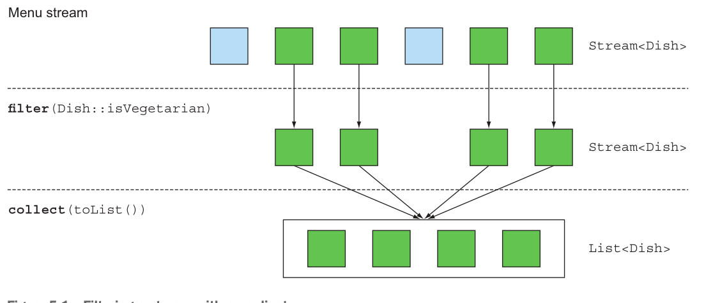
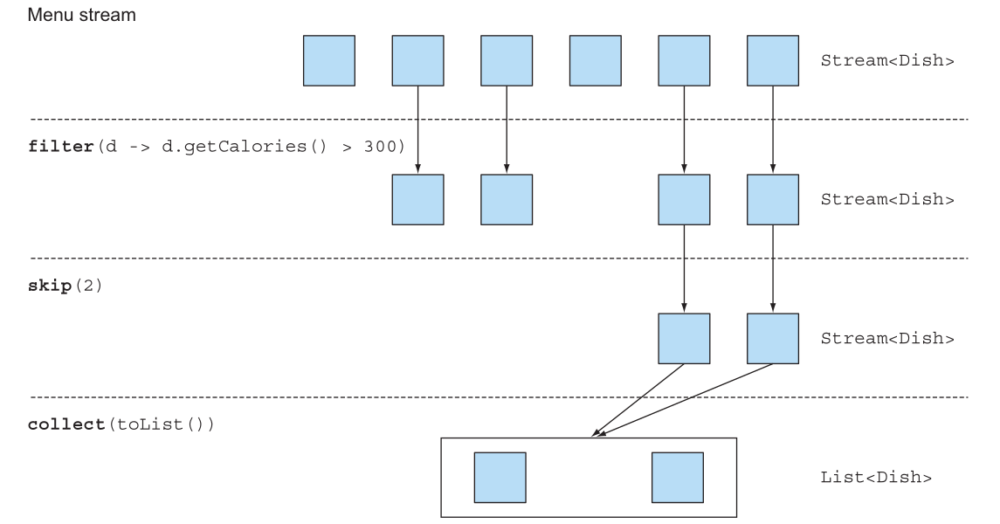
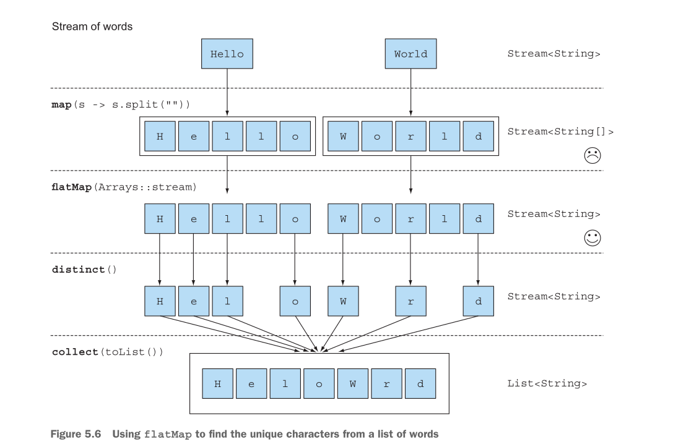

# Guia Completo - Working with Streams

## 📋 Resumo Executivo

### Principais Tópicos:
- **Filtering, slicing, and mapping**
- **Finding, matching, and reducing**
- **Using numeric streams (primitive stream specializations)**
- **Creating streams from multiple sources**
- **Infinite streams**

### ⚡ Resumo Rápido - Working with Streams

• A **API Streams** permite que você expresse consultas complexas de processamento de dados. Operações comuns de stream estão resumidas na tabela 5.1.

• Você pode **filtrar e fatiar** uma stream usando os métodos `filter`, `distinct`, `takeWhile` (Java 9), `dropWhile` (Java 9), `skip`, e `limit`.

• Os métodos **`takeWhile` e `dropWhile`** são mais eficientes que um `filter` quando você sabe que a fonte está ordenada.

• Você pode **extrair ou transformar** elementos de uma stream usando os métodos `map` e `flatMap`.

• Você pode **encontrar elementos** em uma stream usando os métodos `findFirst` e `findAny`.

• Você pode **verificar um predicate** em uma stream usando os métodos `allMatch`, `noneMatch`, e `anyMatch`.

• Esses métodos fazem uso de **short-circuiting**: uma computação para assim que um resultado é encontrado; não há necessidade de processar toda a stream.

• Você pode **combinar todos os elementos** de uma stream iterativamente para produzir um resultado usando o método `reduce`, por exemplo, para calcular a soma ou encontrar o máximo de uma stream.

• Existem **três especializações primitivas** de streams: `IntStream`, `DoubleStream`, e `LongStream`. Suas operações também são especializadas adequadamente.

• **Streams podem ser criadas** não apenas de uma collection mas também de valores, arrays, arquivos, e métodos específicos como `iterate` e `generate`.

### 🎯 Benefício Principal:
Esta forma diferente de trabalhar com dados é útil porque você deixa a API Streams gerenciar como processar os dados. Como consequência, a API Streams pode descobrir várias otimizações por trás dos panos.

---

## 1. Filtering

### 1.1 Filtering with a Predicate

Esta operação recebe como argumento um predicate (uma function que retorna um boolean) e retorna uma stream incluindo todos os elementos que correspondem ao predicate.



### 1.2 Filtering Unique Elements

Streams também suportam um método chamado distinct que retorna uma stream com elementos únicos (de acordo com a implementação dos métodos hashcode e equals dos objetos produzidos pela stream).

```java
List<Integer> numbers = Arrays.asList(1, 2, 1, 3, 3, 2, 4);
numbers.stream()
    .filter(i -> i % 2 == 0)
    .distinct()
    .forEach(System.out::println);
```

---

## 2. Slicing a Stream

Nesta seção, discutiremos como selecionar e pular elementos em uma stream de diferentes formas. Existem operações disponíveis que permitem selecionar ou descartar elementos de forma eficiente usando um predicate, ignorar os primeiros elementos de uma stream, ou truncar uma stream para um tamanho dado.

### 2.1 Slicing Using a Predicate

#### Using takeWhile

```java
List<Dish> specialMenu = Arrays.asList(
    new Dish("seasonal fruit", true, 120, Dish.Type.OTHER),
    new Dish("prawns", false, 300, Dish.Type.FISH),
    new Dish("rice", true, 350, Dish.Type.OTHER),
    new Dish("chicken", false, 400, Dish.Type.MEAT),
    new Dish("french fries", true, 530, Dish.Type.OTHER));
```

Mas, você notará que a lista inicial já estava ordenada pelo número de calorias! A desvantagem de usar a operação filter aqui é que você precisa iterar através de toda a stream e o predicate é aplicado a cada elemento. Em vez disso, você poderia parar assim que encontrasse um prato que é maior que (ou igual a) 320 calorias. A operação takeWhile está aqui para te salvar! Ela permite fatiar qualquer stream (até mesmo uma stream infinita) usando um predicate. Ela para assim que encontra um elemento que falha em corresponder.

```java
List<Dish> slicedMenu1 = specialMenu.stream()
    .takeWhile(dish -> dish.getCalories() < 320)
    .collect(toList());
```

#### Using dropWhile

Que tal obter os outros elementos? Que tal encontrar os elementos que têm mais de 320 calorias? Você pode usar a operação dropWhile para isso:

```java
List<Dish> slicedMenu2 = specialMenu.stream()
    .dropWhile(dish -> dish.getCalories() < 320)
    .collect(toList());
```

A operação dropWhile é o complemento de takeWhile. Ela descarta os elementos no início onde o predicate é falso. Uma vez que o predicate avalia para verdadeiro, ela para e retorna todos os elementos restantes.

### 2.2 Truncating a Stream

Streams suportam o método limit(n), que retorna outra stream que não é maior que um tamanho dado.

```java
List<Dish> dishes = specialMenu.stream()
    .filter(dish -> dish.getCalories() > 300)
    .limit(3) // limita a stream a 3 elementos
    .collect(toList());
```

### 2.3 Skipping Elements

Streams suportam o método skip(n) para retornar uma stream que descarta os primeiros n elementos. Se a stream tem menos que n elementos, uma stream vazia é retornada. Note que limit(n) e skip(n) são complementares!

```java
List<Dish> dishes = menu.stream()
    .filter(d -> d.getCalories() > 300)
    .skip(2)
    .collect(toList());
```



---

## 3. Mapping

### 3.1 Applying a Function to Each Element

Streams suportam o método map, que recebe uma function como argumento. A function é aplicada a cada elemento, mapeando-o para um novo elemento (a palavra mapeamento é usada porque tem um significado similar a transformar, mas com a nuance de "criar uma nova versão de" ao invés de "modificar").

```java
List<String> dishNames = menu.stream()
    .map(Dish::getName)
    .collect(toList());
```

### 3.2 Flattening Streams

#### Attempt Using map and Arrays.stream

A solução atual ainda não funciona! Isso ocorre porque você agora acaba com uma lista de streams (mais precisamente, List<Stream<String>>). De fato, você primeiro converte cada palavra em um array de suas letras individuais e depois faz de cada array uma stream separada.

```java
List<String> words = Arrays.asList("Hello", "World");

words.stream()
    .map(word -> word.split(""))
    .map(Arrays::stream)
    .distinct()
    .collect(toList());
```

#### Using flatMap

Em resumo, o método flatMap permite que você substitua cada valor de uma stream por outra stream e então concatena todas as streams geradas em uma única stream.



```java
List<String> uniqueCharacters = words.stream()
    .map(word -> word.split(""))
    .flatMap(Arrays::stream)
    .distinct()
    .collect(toList());
```

---

## 4. Finding and Matching

### 4.1 Checking to See if a Predicate Matches at Least One Element

```java
if(menu.stream().anyMatch(Dish::isVegetarian)) {
    System.out.println("The menu is (somewhat) vegetarian friendly!!");
}
```

### 4.2 Checking to See if a Predicate Matches All Elements

```java
if(menu.stream().allMatch(dish -> dish.getCalories() < 1000)) {
    System.out.println("The menu is healthy!!");
}
```

### 4.3 noneMatch

O oposto do allMatch:

```java
boolean isHealthy = menu.stream()
    .noneMatch(d -> d.getCalories() >= 1000);
```

Essas três operações—anyMatch, allMatch, e noneMatch—fazem uso do que chamamos de short-circuiting, uma versão de stream dos familiares operadores Java de short-circuiting && e ||.

> [!NOTE]
> **Short-circuiting evaluation**
>
> Algumas operações não precisam processar toda a stream para produzir um resultado. Por exemplo, digamos que você precisa avaliar uma grande expressão boolean encadeada com operadores and. Você precisa apenas descobrir que uma expressão é falsa para deduzir que toda a expressão retornará falso, não importa quão longa a expressão seja; não há necessidade de avaliar toda a expressão. É a isso que short-circuiting se refere.

### 4.4 Finding an Element

A classe Optional<T> (java.util.Optional) é uma classe container para representar a existência ou ausência de um valor. No código anterior, é possível que findAny não encontre nenhum elemento.

```java
Optional<Dish> dish = menu.stream()
    .filter(Dish::isVegetarian)
    .findAny();
```

### 4.5 Finding the First Element

```java
List<Integer> someNumbers = Arrays.asList(1, 2, 3, 4, 5);
Optional<Integer> firstSquareDivisibleByThree = someNumbers.stream()
    .map(n -> n * n)
    .filter(n -> n % 3 == 0)
    .findFirst(); // 9
```

> [!TIP]
> **When to use findAny vs findFirst**
>
> Você pode se perguntar por que temos tanto findFirst quanto findAny. A resposta é paralelismo. Encontrar o primeiro elemento é mais restritivo em paralelo. Se você não se importa com qual elemento é retornado, use findAny porque é menos restritivo ao usar streams paralelas.

---

## 5. Reducing

### 5.1 Summing the Elements

O reduce utiliza a interface BinaryOperator<T>:

```java
int sum = numbers.stream().reduce(0, (a, b) -> a + b);
```

### 5.2 Maximum and Minimum

Podemos utilizar o reduce para encontrar o máximo e o mínimo de uma stream:

```java
Optional<Integer> max = numbers.stream()
    .reduce(Integer::max);

Optional<Integer> min = numbers.stream()
    .reduce(Integer::min);
```

> [!NOTE]
> **Stream operations: stateless vs. stateful**
>
> As operações de stream têm características diferentes quanto ao estado interno. Operações como map e filter são stateless: processam cada elemento independentemente sem manter estado interno. Já operações como reduce, sum e max são stateful com estado limitado: precisam acumular resultados mas o estado é pequeno (um int ou double). Por outro lado, operações como sorted e distinct são stateful com estado ilimitado: precisam conhecer todo o histórico anterior para funcionar, requerendo que todos os elementos sejam armazenados em buffer antes de produzir saída, o que pode ser problemático com streams grandes ou infinitas.

---

## 6. Tabela de Referência - Operações de Streams

| **Operação** | **Tipo** | **Tipo de Retorno** | **Tipo/Interface Funcional Usada** | **Function Descriptor** |
|--------------|----------|---------------------|-------------------------------------|-------------------------|
| `filter` | Intermediária | `Stream<T>` | `Predicate<T>` | `T -> boolean` |
| `distinct` | Intermediária (stateful-unbounded) | `Stream<T>` | - | - |
| `takeWhile` | Intermediária | `Stream<T>` | `Predicate<T>` | `T -> boolean` |
| `dropWhile` | Intermediária | `Stream<T>` | `Predicate<T>` | `T -> boolean` |
| `skip` | Intermediária (stateful-bounded) | `Stream<T>` | `long` | - |
| `limit` | Intermediária (stateful-bounded) | `Stream<T>` | `long` | - |
| `map` | Intermediária | `Stream<R>` | `Function<T, R>` | `T -> R` |
| `flatMap` | Intermediária | `Stream<R>` | `Function<T, Stream<R>>` | `T -> Stream<R>` |
| `sorted` | Intermediária (stateful-unbounded) | `Stream<T>` | `Comparator<T>` | `(T, T) -> int` |
| `anyMatch` | Terminal | `boolean` | `Predicate<T>` | `T -> boolean` |
| `noneMatch` | Terminal | `boolean` | `Predicate<T>` | `T -> boolean` |
| `allMatch` | Terminal | `boolean` | `Predicate<T>` | `T -> boolean` |
| `findAny` | Terminal | `Optional<T>` | - | - |
| `findFirst` | Terminal | `Optional<T>` | - | - |
| `forEach` | Terminal | `void` | `Consumer<T>` | `T -> void` |
| `collect` | Terminal | `R` | `Collector<T, A, R>` | - |
| `reduce` | Terminal (stateful-bounded) | `Optional<T>` | `BinaryOperator<T>` | `(T, T) -> T` |
| `count` | Terminal | `long` | - | - |

### **Tipos de Operações:**
- **Intermediária**: Retorna uma stream, permite encadeamento
- **Terminal**: Retorna um resultado final, encerra o pipeline

### **Características de Estado:**
- **stateful-bounded**: Mantém estado limitado (como `limit`, `skip`)
- **stateful-unbounded**: Mantém estado ilimitado (como `sorted`, `distinct`)
- **stateless**: Não mantém estado (como `filter`, `map`)

---

## 7. Numeric Streams

### 7.1 O Problema do Boxing

```java
int calories = menu.stream()
    .map(Dish::getCalories)
    .reduce(0, Integer::sum);
```

O problema com esse código é que há um custo insidioso de boxing. Por trás dos panos, cada Integer precisa ser unboxed para um primitivo antes de realizar a soma.

### 7.2 Primitive Stream Specializations

O Java 8 introduz três interfaces de stream especializadas para primitivos para resolver essa questão: IntStream, DoubleStream, e LongStream, que respectivamente especializam os elementos de uma stream para serem int, long, e double—e assim evitam custos ocultos de boxing.

```java
int calories = menu.stream()
    .mapToInt(Dish::getCalories)
    .sum();
```

### 7.3 Converting Back to a Stream of Objects

```java
IntStream intStream = menu.stream().mapToInt(Dish::getCalories);
Stream<Integer> stream = intStream.boxed();
```

### 7.4 Default Values: OptionalInt

Há uma versão especializada para primitivos do Optional também para as três especializações de stream primitivas: OptionalInt, OptionalDouble, e OptionalLong.

```java
OptionalInt maxCalories = menu.stream()
    .mapToInt(Dish::getCalories)
    .max();

int max = maxCalories.orElse(1);
```

### 7.5 Numeric Ranges

range e rangeClosed. Ambos os métodos recebem o valor inicial do intervalo como primeiro parâmetro e o valor final do intervalo como segundo parâmetro. Mas range é exclusivo, enquanto rangeClosed é inclusivo.

```java
IntStream evenNumbers = IntStream.rangeClosed(1, 100)
    .filter(n -> n % 2 == 0);
```

---

## 8. Building Streams

### 8.1 Streams from Values

```java
Stream<String> stream = Stream.of("Modern ", "Java ", "In ", "Action");
stream.map(String::toUpperCase).forEach(System.out::println);
```

### 8.2 Stream from Nullable

```java
Stream<String> homeValueStream = Stream.ofNullable(System.getProperty("home"));
```

Este padrão pode ser particularmente útil em conjunto com flatMap e uma stream de valores que podem incluir objetos nullable:

```java
Stream<String> values = Stream.of("config", "home", "user")
    .flatMap(key -> Stream.ofNullable(System.getProperty(key)));
```

### 8.3 Streams from Arrays

Você pode criar uma stream de um array usando o método estático Arrays.stream, que recebe um array como parâmetro. Por exemplo, você pode converter um array de ints primitivos em um IntStream e então somar o IntStream para produzir um int.

```java
int[] numbers = {2, 3, 5, 7, 11, 13};
int sum = Arrays.stream(numbers).sum();
```

### 8.4 Streams from Files

A API NIO do Java (non-blocking I/O), que é usada para operações de I/O como processar um arquivo, foi atualizada para aproveitar a API Streams. Muitos métodos estáticos em java.nio.file.Files retornam uma stream.

```java
long uniqueWords = 0;
try(Stream<String> lines =
    Files.lines(Paths.get("data.txt"), Charset.defaultCharset())) { // Streams são AutoCloseable

    uniqueWords = lines.flatMap(line -> Arrays.stream(line.split(" "))) // Gera uma stream de palavras
                      .distinct()                                        // Remove duplicatas
                      .count();                                         // Conta o número de palavras únicas
}
catch(IOException e) {
    // Lida com a exception se uma ocorrer ao abrir o arquivo
}
```

---

## 9. Streams from Functions: Creating Infinite Streams!

### 9.1 iterate

```java
Stream.iterate(0, n -> n + 2)
    .limit(10)
    .forEach(System.out::println);
```

Note que essa operação produz uma stream infinita—a stream não tem fim porque valores são computados sob demanda e podem ser computados para sempre. Dizemos que a stream é unbounded.

Em geral, você deveria usar iterate quando precisar produzir uma sequência de valores sucessivos (por exemplo, uma data seguida por sua próxima data: 31 de janeiro, 1º de fevereiro, e assim por diante).

### 9.2 generate

Similarmente ao método iterate, o método generate permite que você produza uma stream infinita de valores computados sob demanda. Mas generate não aplica sucessivamente uma function em cada novo valor produzido. Ele recebe uma lambda do tipo Supplier<T> para fornecer novos valores.

```java
Stream.generate(Math::random)
    .limit(5)
    .forEach(System.out::println);
```

---

## 10. Principais Aprendizados

### **Eficiência e Performance**
- Use `takeWhile`/`dropWhile` para dados ordenados
- Aproveite short-circuiting para otimização
- Considere especializações primitivas para evitar boxing

### **Flexibilidade**
- Combine operações para queries complexas
- Use `flatMap` para estruturas aninhadas
- Crie streams de múltiplas fontes

### **Paralelização**
- Streams podem ser paralelizadas transparentemente
- Operações stateless são mais eficientes em paralelo
- Cuidado com operações stateful em paralelo

---

## 🎯 Conclusão

Foi um capítulo longo mas recompensador! Agora você pode processar collections de forma mais efetiva. De fato, streams permitem que você expresse consultas sofisticadas de processamento de dados de forma concisa. Além disso, streams podem ser paralelizadas de forma transparente.

As Streams revolucionaram o processamento de dados em Java, oferecendo uma API poderosa, expressiva e eficiente para manipulação de collections.

---

*Este guia demonstra como trabalhar eficientemente com streams, desde operações básicas até técnicas avançadas de criação e manipulação de dados.*
