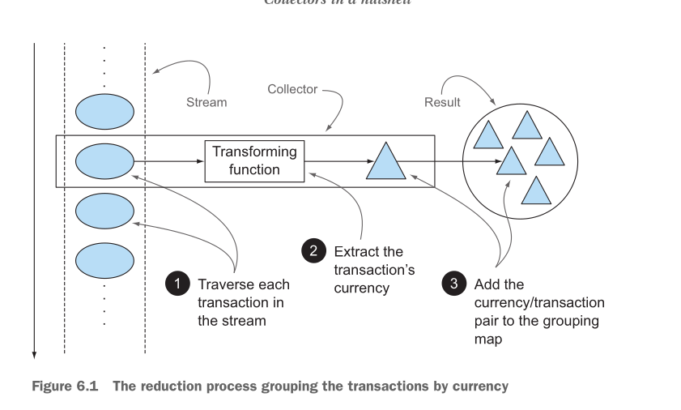
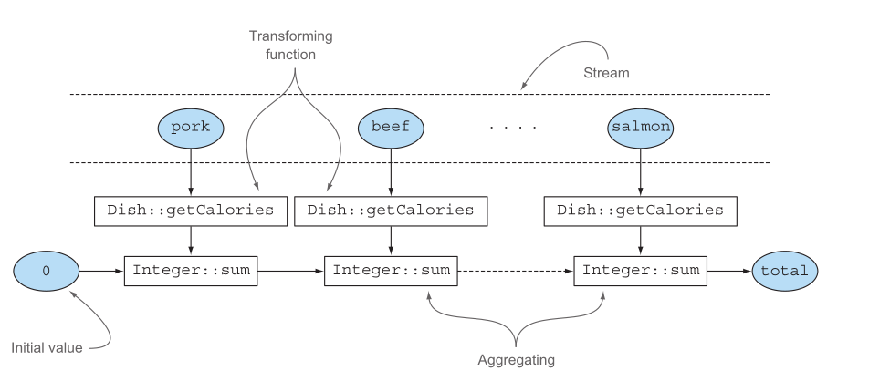
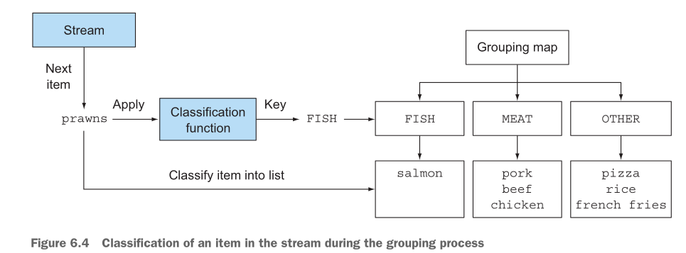
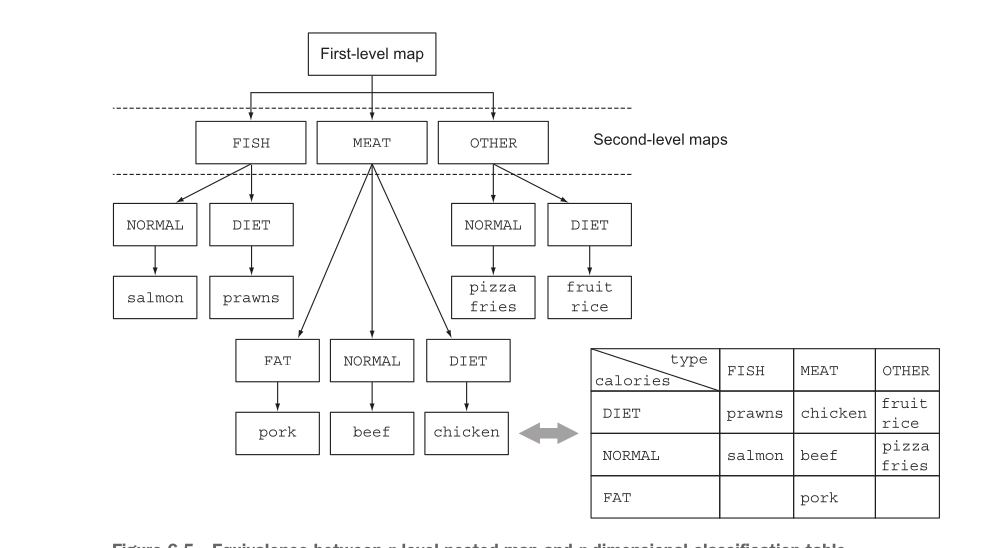
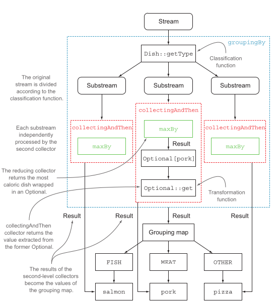

# Collecting Data with Streams - Guia de Revisão

## 📋 Resumo Executivo

Este guia aborda **collectors** em Java 8+, focando em como usar `collect()` para transformar streams em coleções e valores resumidos. Os principais tópicos incluem:

- **Collectors predefinidos** para redução, sumarização e agrupamento
- **Operações de agrupamento** com `groupingBy()` e `partitioningBy()`
- **Collectors customizados** implementando a interface `Collector`
- **Otimizações** para processamento paralelo e performance

### 🎯 Exemplos Práticos que Você Dominará:
```java
// Agrupar transações por moeda
Map<Currency, List<Transaction>> transactionsByCurrency =
    transactions.stream().collect(groupingBy(Transaction::getCurrency));

// Particionar transações em caras vs baratas
Map<Boolean, List<Transaction>> expensiveTransactions =
    transactions.stream().collect(partitioningBy(t -> t.getValue() > 1000));

// Agrupamento multinível
Map<String, Map<Boolean, List<Transaction>>> cityAndExpensive =
    transactions.stream().collect(
        groupingBy(Transaction::getCity,
            partitioningBy(t -> t.getValue() > 1000)));
```

---

## 🔄 Evolução: Antes vs Depois do Java 8

### ❌ **Antes do Java 8** (Verboso e Propenso a Erros)
```java
Map<Currency, List<Transaction>> transactionsByCurrencies = new HashMap<>();

for (Transaction transaction : transactions) {
    Currency currency = transaction.getCurrency();
    List<Transaction> transactionsForCurrency = transactionsByCurrencies.get(currency);

    if (transactionsForCurrency == null) {
        transactionsForCurrency = new ArrayList<>();
        transactionsByCurrencies.put(currency, transactionsForCurrency);
    }

    transactionsForCurrency.add(transaction);
}
```

### ✅ **Depois do Java 8** (Conciso e Expressivo)
```java
Map<Currency, List<Transaction>> transactionsByCurrencies =
    transactions.stream().collect(groupingBy(Transaction::getCurrency));
```

---

## 🧩 Collectors em Resumo

O argumento do método `collect()` é uma implementação da interface `Collector` - uma "receita" de como construir um resumo dos elementos na stream.



### 📦 Categorias de Collectors Predefinidos:
1. **Redução e Sumarização** → Um único valor
2. **Agrupamento** → Map com elementos agrupados
3. **Particionamento** → Map com chave Boolean

---

## 📊 Redução e Sumarização

### 🔢 **Contagem**
```java
// Duas formas equivalentes
long howManyDishes = menu.stream().collect(counting());
long howManyDishes = menu.stream().count();
```

### 📈 **Máximo e Mínimo**
```java
Comparator<Dish> dishCaloriesComparator =
    Comparator.comparingInt(Dish::getCalories);

Optional<Dish> mostCalorieDish = menu.stream()
    .collect(maxBy(dishCaloriesComparator));
```

### ➕ **Sumarização Numérica**
```java
// Soma
int totalCalories = menu.stream().collect(summingInt(Dish::getCalories));

// Média
double avgCalories = menu.stream().collect(averagingInt(Dish::getCalories));

// Estatísticas completas
IntSummaryStatistics menuStats = menu.stream()
    .collect(summarizingInt(Dish::getCalories));
// Resultado: IntSummaryStatistics{count=9, sum=4300, min=120, average=477.777778, max=800}
```

### 🔤 **Concatenação de Strings**
```java
// Sem separador
String shortMenu = menu.stream().map(Dish::getName).collect(joining());

// Com separador
String shortMenu = menu.stream().map(Dish::getName).collect(joining(", "));
```

### 🔄 **Redução Generalizada**
```java
// Equivalente ao summingInt
int totalCalories = menu.stream().collect(reducing(
    0, Dish::getCalories, (i, j) -> i + j));

// Encontrar prato com mais calorias
Optional<Dish> mostCalorieDish = menu.stream().collect(reducing(
    (d1, d2) -> d1.getCalories() > d2.getCalories() ? d1 : d2));
```

---

## 🆚 Collect vs Reduce - Diferenças Fundamentais

### 🎯 **Resumo: collect vs reduce**

#### **reduce** → Valores Simples
```java
// ✅ Combine elementos em UM valor
int soma = stream.reduce(0, Integer::sum);
Optional<String> maior = stream.reduce(Integer::max);
String texto = stream.reduce("", String::concat);
```

#### **collect** → Coleções/Containers
```java
// ✅ Acumule elementos em COLEÇÕES
List<T> lista = stream.collect(toList());
Set<T> conjunto = stream.collect(toSet());
Map<K,V> mapa = stream.collect(groupingBy(...));
String unido = stream.collect(joining(", "));
```

#### **Regra de Ouro:**
- **reduce** = Criar **novo valor** (imutável)
- **collect** = Preencher **container** (mutável)

#### **Por que não misturar:**
```java
// ❌ NUNCA faça isso (reduce mutando lista)
stream.reduce(new ArrayList<>(), (list, item) -> {
    list.add(item); // ← Mutação = Perigoso em paralelo!
    return list;
});

// ✅ Use collect para listas
stream.collect(toList()); // ← Seguro e eficiente
```

**🚀 Memorize: reduce para valores, collect para containers!**

---

## 🔀 Flexibilidade: Múltiplas Formas de Fazer a Mesma Operação



### 🎯 **Resumo: reducing vs joining**

#### **Original (joining):**
```java
String menu = menu.stream().map(Dish::getName).collect(joining());
```

#### **Alternativas com reducing:**

##### ✅ **Opção 1 - Válida:**
```java
String menu = menu.stream().map(Dish::getName)
    .collect(reducing((s1, s2) -> s1 + s2)).get();
```

##### ❌ **Opção 2 - ERRO:**
```java
String menu = menu.stream()
    .collect(reducing((d1, d2) -> d1.getName() + d2.getName())).get();
```
- **Problema**: `BinaryOperator<Dish>` mas retorna `String`

##### ✅ **Opção 3 - Válida:**
```java
String menu = menu.stream()
    .collect(reducing("", Dish::getName, (s1, s2) -> s1 + s2));
```

#### **💡 Conclusão:**
```java
// ✅ MELHOR - Use sempre joining()
.collect(joining())

// ❌ Evite reducing para concatenação
.collect(reducing(...))
```

---

## 🗂️ Agrupamento (Grouping)

### 📋 **Agrupamento Básico**
```java
Map<Dish.Type, List<Dish>> dishesByType =
    menu.stream().collect(groupingBy(Dish::getType));

// Resultado: {FISH=[prawns, salmon], OTHER=[french fries, rice, season fruit, pizza], MEAT=[pork, beef, chicken]}
```

### 🎯 **Agrupamento com Classificação Customizada**
```java
public enum CaloricLevel { DIET, NORMAL, FAT }

Map<CaloricLevel, List<Dish>> dishesByCaloricLevel = menu.stream().collect(
    groupingBy(dish -> {
        if (dish.getCalories() <= 400) return CaloricLevel.DIET;
        else if (dish.getCalories() <= 700) return CaloricLevel.NORMAL;
        else return CaloricLevel.FAT;
    }));
```



---

## 🔧 Manipulação de Elementos Agrupados

### 🎯 **Filtragem Dentro de Agrupamentos**

#### **❌ Problema: Filtrar ANTES do agrupamento**
```java
// Remove grupos vazios! FISH desaparece do Map
Map<Dish.Type, List<Dish>> caloricDishesByType = menu.stream()
    .filter(dish -> dish.getCalories() > 500)  // ← Filtro antes
    .collect(groupingBy(Dish::getType));

// Resultado: {OTHER=[french fries, pizza], MEAT=[pork, beef]}
// ❌ FISH sumiu completamente!
```

#### **✅ Solução: Filtrar DENTRO do agrupamento**
```java
// Mantém todos os grupos, mas filtra dentro de cada um
Map<Dish.Type, List<Dish>> caloricDishesByType = menu.stream()
    .collect(groupingBy(Dish::getType,
             filtering(dish -> dish.getCalories() > 500, toList())));

// Resultado: {FISH=[], OTHER=[french fries, pizza], MEAT=[pork, beef]}
// ✅ FISH permanece (vazio, mas presente)
```

### 🗺️ **Mapeamento**
```java
Map<Dish.Type, List<String>> dishNamesByType = menu.stream()
    .collect(groupingBy(Dish::getType, mapping(Dish::getName, toList())));
```

### 🌊 **Flat Mapping**
```java
Map<String, List<String>> dishTags = new HashMap<>();
dishTags.put("pork", asList("greasy", "salty"));
dishTags.put("beef", asList("salty", "roasted"));
// ... mais tags

Map<Dish.Type, Set<String>> dishTagsByType = menu.stream()
    .collect(groupingBy(Dish::getType,
        flatMapping(dish -> dishTags.get(dish.getName()).stream(), toSet())));
```

---

## 📊 Agrupamento Multinível



```java
Map<Dish.Type, Map<CaloricLevel, List<Dish>>> dishesByTypeCaloricLevel =
    menu.stream().collect(
        groupingBy(Dish::getType,                    // Classificação de primeiro nível
            groupingBy(dish -> {                     // Classificação de segundo nível
                if (dish.getCalories() <= 400) return CaloricLevel.DIET;
                else if (dish.getCalories() <= 700) return CaloricLevel.NORMAL;
                else return CaloricLevel.FAT;
            })
        )
    );

// Resultado:
// {MEAT={DIET=[chicken], NORMAL=[beef], FAT=[pork]},
//  FISH={DIET=[prawns], NORMAL=[salmon]},
//  OTHER={DIET=[rice, seasonal fruit], NORMAL=[french fries, pizza]}}
```

---

## 📈 Coletando Dados em Subgrupos

### 🔢 **Contagem por Grupo**
```java
Map<Dish.Type, Long> typesCount = menu.stream()
    .collect(groupingBy(Dish::getType, counting()));
// Resultado: {MEAT=3, FISH=2, OTHER=4}
```

### 🏆 **Máximo por Grupo**
```java
Map<Dish.Type, Optional<Dish>> mostCaloricByType = menu.stream()
    .collect(groupingBy(Dish::getType,
        maxBy(comparingInt(Dish::getCalories))));
// Resultado: {FISH=Optional[salmon], OTHER=Optional[pizza], MEAT=Optional[pork]}
```

### 🎯 **Adaptando o Resultado do Collector**
```java
Map<Dish.Type, Dish> mostCaloricByType = menu.stream()
    .collect(groupingBy(Dish::getType,
        collectingAndThen(
            maxBy(comparingInt(Dish::getCalories)),
            Optional::get)));
// Resultado: {FISH=salmon, OTHER=pizza, MEAT=pork}
```



### ➕ **Outros Exemplos**

#### **Soma por Grupo**
```java
Map<Dish.Type, Integer> totalCaloriesByType = menu.stream()
    .collect(groupingBy(Dish::getType, summingInt(Dish::getCalories)));
// Resultado: {FISH=800, OTHER=1200, MEAT=2100}
```

#### **Mapeamento para Set**
```java
Map<Dish.Type, Set<CaloricLevel>> caloricLevelsByType = menu.stream()
    .collect(groupingBy(Dish::getType,
        mapping(dish -> {
            if (dish.getCalories() <= 400) return CaloricLevel.DIET;
            else if (dish.getCalories() <= 700) return CaloricLevel.NORMAL;
            else return CaloricLevel.FAT;
        }, toSet())));
// Resultado: {FISH=[DIET, NORMAL], OTHER=[DIET, NORMAL, FAT], MEAT=[DIET, NORMAL, FAT]}
```

#### **💡 Controlando o Tipo de Set**
```java
Map<Dish.Type, Set<CaloricLevel>> caloricLevelsByType = menu.stream()
    .collect(groupingBy(Dish::getType,
        mapping(dish -> {
            if (dish.getCalories() <= 400) return CaloricLevel.DIET;
            else if (dish.getCalories() <= 700) return CaloricLevel.NORMAL;
            else return CaloricLevel.FAT;
        }, toCollection(HashSet::new))));  // ← Garante que será HashSet
```

---

## ⚖️ Particionamento (Partitioning)

Particionamento é um **caso especial de agrupamento** usando um `Predicate` como função de classificação, resultando em um `Map<Boolean, List<T>>`.

### 📋 **Particionamento Básico**
```java
Map<Boolean, List<Dish>> partitionedMenu =
    menu.stream().collect(partitioningBy(Dish::isVegetarian));

// Resultado:
// {false=[pork, beef, chicken, prawns, salmon],
//  true=[french fries, rice, season fruit, pizza]}
```

### 🎯 **Vantagens do Particionamento**
```java
// Particionar E agrupar
Map<Boolean, Map<Dish.Type, List<Dish>>> vegetarianDishesByType =
    menu.stream().collect(
        partitioningBy(Dish::isVegetarian,        // Partitioning function
            groupingBy(Dish::getType)));          // Second collector

// Resultado:
// {false = {MEAT=[pork, beef, chicken], FISH=[prawns, salmon]},
//  true = {OTHER=[rice, fruit, pizza]}}
```

### 🏆 **Prato Mais Calórico por Partição**
```java
Map<Boolean, Dish> mostCaloricPartitionedByVegetarian = menu.stream()
    .collect(partitioningBy(Dish::isVegetarian,
        collectingAndThen(maxBy(comparingInt(Dish::getCalories)),
            Optional::get)));
// Resultado: {false=pork, true=pizza}
```

---

## 📋 Tabela de Referência - Factory Methods dos Collectors

| **Factory Method** | **Tipo de Retorno** | **Usado Para** | **Exemplo** |
|-------------------|---------------------|----------------|-------------|
| `toList` | `List<T>` | Coletar em List | `stream.collect(toList())` |
| `toSet` | `Set<T>` | Coletar em Set | `stream.collect(toSet())` |
| `toCollection` | `Collection<T>` | Coletar em Collection específica | `stream.collect(toCollection(ArrayList::new))` |
| `counting` | `Long` | Contar elementos | `stream.collect(counting())` |
| `summingInt` | `Integer` | Somar valores int | `stream.collect(summingInt(Dish::getCalories))` |
| `averagingInt` | `Double` | Média de valores int | `stream.collect(averagingInt(Dish::getCalories))` |
| `summarizingInt` | `IntSummaryStatistics` | Estatísticas completas | `stream.collect(summarizingInt(Dish::getCalories))` |
| `joining` | `String` | Concatenar strings | `stream.collect(joining(", "))` |
| `maxBy` | `Optional<T>` | Elemento máximo | `stream.collect(maxBy(comparator))` |
| `minBy` | `Optional<T>` | Elemento mínimo | `stream.collect(minBy(comparator))` |
| `reducing` | `T` | Redução customizada | `stream.collect(reducing(0, Integer::sum))` |
| `collectingAndThen` | `R` | Transformar resultado | `stream.collect(collectingAndThen(toList(), List::size))` |
| `groupingBy` | `Map<K, List<T>>` | Agrupar por chave | `stream.collect(groupingBy(Dish::getType))` |
| `partitioningBy` | `Map<Boolean, List<T>>` | Particionar por predicate | `stream.collect(partitioningBy(Dish::isVegetarian))` |

---

## 🔧 Interface Collector

### 📝 **Definição da Interface**
```java
public interface Collector<T, A, R> {
    Supplier<A> supplier();           // Cria container vazio
    BiConsumer<A, T> accumulator();   // Adiciona elemento ao container
    Function<A, R> finisher();        // Transformação final
    BinaryOperator<A> combiner();     // Combina containers (paralelismo)
    Set<Characteristics> characteristics(); // Otimizações
}
```

### 🔧 **Implementação dos Métodos**

#### **1. Supplier - Criando Container Vazio**
```java
public Supplier<List<T>> supplier() {
    return ArrayList::new;
}
```

#### **2. Accumulator - Adicionando Elementos**
```java
public BiConsumer<List<T>, T> accumulator() {
    return List::add;
}
```

#### **3. Finisher - Transformação Final**
```java
public Function<List<T>, List<T>> finisher() {
    return Function.identity(); // Sem transformação necessária
}
```

#### **4. Combiner - Combinando Containers**
```java
public BinaryOperator<List<T>> combiner() {
    return (list1, list2) -> {
        list1.addAll(list2);
        return list1;
    };
}
```

#### **5. Characteristics - Otimizações**
```java
public Set<Characteristics> characteristics() {
    return Collections.unmodifiableSet(EnumSet.of(
        IDENTITY_FINISH,  // Sem transformação final
        CONCURRENT));     // Suporte a paralelismo
}
```

### 🏗️ **Collector Completo - ToListCollector**
```java
public class ToListCollector<T> implements Collector<T, List<T>, List<T>> {
    @Override
    public Supplier<List<T>> supplier() {
        return ArrayList::new;
    }

    @Override
    public BiConsumer<List<T>, T> accumulator() {
        return List::add;
    }

    @Override
    public Function<List<T>, List<T>> finisher() {
        return Function.identity();
    }

    @Override
    public BinaryOperator<List<T>> combiner() {
        return (list1, list2) -> {
            list1.addAll(list2);
            return list1;
        };
    }

    @Override
    public Set<Characteristics> characteristics() {
        return Collections.unmodifiableSet(EnumSet.of(
            IDENTITY_FINISH, CONCURRENT));
    }
}
```

### 🚀 **Collect sem Implementar Collector**
```java
// Para collectors IDENTITY_FINISH, use a forma abreviada
List<Dish> dishes = menuStream.collect(
    ArrayList::new,  // Supplier
    List::add,       // Accumulator
    List::addAll);   // Combiner
```

---

## 🎯 Exemplo Prático: Collector de Números Primos

### 📋 **Implementação Completa**
```java
public class PrimeNumbersCollector
        implements Collector<Integer, Map<Boolean, List<Integer>>, Map<Boolean, List<Integer>>> {

    @Override
    public Supplier<Map<Boolean, List<Integer>>> supplier() {
        return () -> new HashMap<Boolean, List<Integer>>() {{
            put(true, new ArrayList<>());
            put(false, new ArrayList<>());
        }};
    }

    @Override
    public BiConsumer<Map<Boolean, List<Integer>>, Integer> accumulator() {
        return (acc, candidate) -> {
            acc.get(isPrime(acc.get(true), candidate)).add(candidate);
        };
    }

    @Override
    public BinaryOperator<Map<Boolean, List<Integer>>> combiner() {
        return (map1, map2) -> {
            map1.get(true).addAll(map2.get(true));
            map1.get(false).addAll(map2.get(false));
            return map1;
        };
    }

    @Override
    public Function<Map<Boolean, List<Integer>>, Map<Boolean, List<Integer>>> finisher() {
        return Function.identity();
    }

    @Override
    public Set<Characteristics> characteristics() {
        return Collections.unmodifiableSet(EnumSet.of(IDENTITY_FINISH));
    }
}
```

### 🚀 **Uso do Collector**
```java
public Map<Boolean, List<Integer>> partitionPrimesWithCustomCollector(int n) {
    return IntStream.rangeClosed(2, n).boxed()
        .collect(new PrimeNumbersCollector());
}
```

---

## 📚 Resumo Final

### ✅ **Principais Aprendizados:**

1. **`collect`** é uma operação terminal que usa *collectors* para acumular elementos em resultados resumidos
2. **Collectors predefinidos** cobrem a maioria dos casos: redução, sumarização, agrupamento e particionamento
3. **Composição eficiente** permite criar agrupamentos e particionamentos em múltiplos níveis
4. **Collectors customizados** são possíveis implementando a interface `Collector`
5. **Otimizações automáticas** através das características do collector

### 🎯 **Quando Usar Cada Abordagem:**

- **`toList()`, `toSet()`** → Coletar em coleções básicas
- **`groupingBy()`** → Agrupar por critério específico
- **`partitioningBy()`** → Dividir em verdadeiro/falso
- **`reducing()`** → Redução customizada
- **`collectingAndThen()`** → Transformar resultado final
- **Collector customizado** → Lógica de coleta muito específica

### 🚀 **Dicas de Performance:**

- Use **collectors predefinidos** sempre que possível
- **Combine collectors** para operações em múltiplos níveis
- Considere **características** para otimizações paralelas
- **Evite** usar `reducing()` para operações que têm collectors específicos
