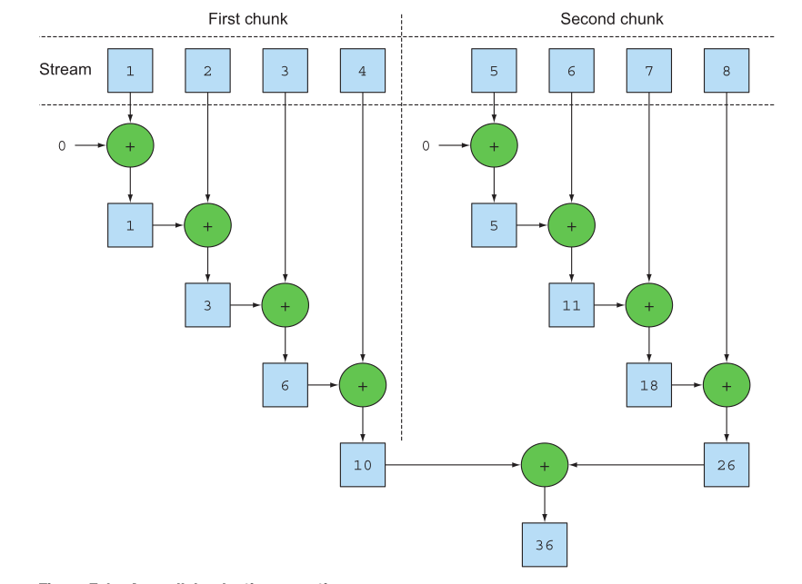
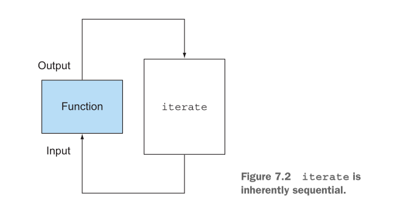
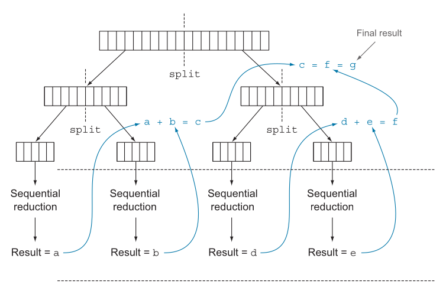
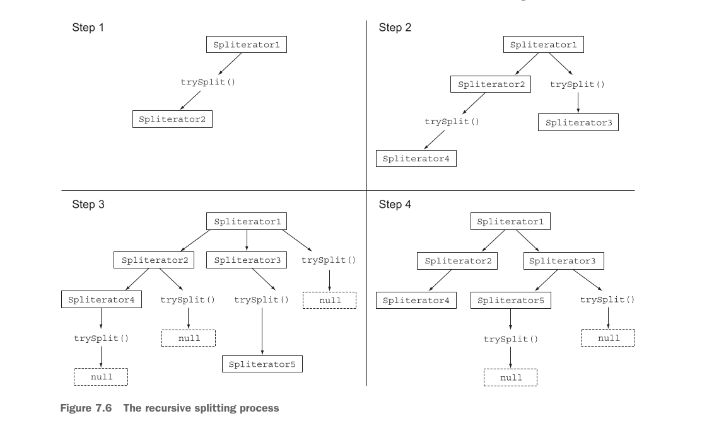

# 📊 Processamento Paralelo de Dados e Performance

## 🎯 **Evolução do Processamento Paralelo**

### **Complexidade Antes dos Parallel Streams**
Antes do Java 8, implementar processamento paralelo era uma tarefa complexa e propensa a erros que exigia quatro etapas manuais obrigatórias. Primeiro, era necessário dividir explicitamente a estrutura de dados contendo os elementos em subpartes menores, determinando manualmente como particionar arrays, listas ou outras coleções de forma equilibrada. Segundo, cada subparte precisava ser atribuída a uma thread diferente, exigindo conhecimento detalhado sobre gerenciamento de threads e pools. Terceiro, era fundamental implementar sincronização adequada para evitar race conditions indesejadas, aguardar a conclusão de todas as threads usando mecanismos como `CountDownLatch` ou `synchronized` blocks. Quarto, era necessário combinar os resultados parciais de cada thread em um resultado final coerente, garantindo que a lógica de agregação fosse thread-safe.

### **Revolução dos Parallel Streams**
Os parallel streams revolucionaram este paradigma ao introduzir o conceito de **iteração interna**. Um parallel stream é fundamentalmente um stream que divide automaticamente seus elementos em múltiplos chunks, processando cada chunk com uma thread diferente. Esta abordagem permite automaticamente particionar a carga de trabalho de uma determinada operação entre todos os cores do processador multicore e mantê-los todos igualmente ocupados, abstraindo completamente a complexidade do gerenciamento manual de threads.

---

## 🔄 **Mecânica de Transformação de Streams**

### **Conversão Simples mas Poderosa**
A transformação de um stream sequencial em paralelo é deceptivamente simples, requerendo apenas a chamada do método `parallel()`:

```java
public long parallelSum(long n) {
   return Stream.iterate(1L, i -> i + 1)
           .limit(n)
           .parallel()  // Transforma o stream em um paralelo
           .reduce(0L, Long::sum);
}
```



Esta simplicidade esconde uma complexidade considerável nos bastidores, onde o framework gerencia automaticamente a criação de threads, distribuição de trabalho, sincronização de resultados e balanceamento de carga através do algoritmo work-stealing.

### **Controle Bidirecional com Limitação Arquitetural**
É possível alternar entre execução paralela e sequencial múltiplas vezes dentro do mesmo pipeline:

```java
stream.parallel()
    .filter(...)      // Será executado em paralelo
    .sequential()
    .map(...)         // Será executado sequencialmente
    .parallel()
    .reduce();        // Será executado em paralelo
```

**Limitação Crítica**: A última chamada para `parallel()` ou `sequential()` determina o modo de execução para **todo** o pipeline. No exemplo acima, todo o pipeline será executado em paralelo porque `parallel()` foi a última chamada, representando uma limitação arquitetural importante.

### **Configuração do Thread Pool e Suas Limitações**
Os parallel streams utilizam internamente o `ForkJoinPool` padrão (common pool) com características específicas: o tamanho padrão é igual ao número de processadores disponíveis retornado por `Runtime.getRuntime().availableProcessors()`. Você pode alterar o tamanho do pool usando a propriedade do sistema `java.util.concurrent.ForkJoinPool.common.parallelism`, mas esta é uma configuração global que afeta **todos** os parallel streams do código. Atualmente não é possível especificar este valor para um único parallel stream, e o tamanho padrão é uma escolha otimizada que deve ser modificada apenas quando houver uma boa razão técnica.

---

## 📏 **Medição Científica de Performance**

### **O Imperativo da Medição**
Ao otimizar performance, você deve sempre seguir três regras de ouro fundamentais: **medir, medir, medir**. Adivinhar nunca é uma boa ideia em engenharia de software, especialmente com parallel streams onde a performance superior não é garantida. É obrigatório usar ferramentas especializadas como o **Java Microbenchmark Harness (JMH)**, que ajuda a criar microbenchmarks confiáveis para programas Java.

### **Configuração Completa do JMH**
```xml
<dependency>
    <groupId>org.openjdk.jmh</groupId>
    <artifactId>jmh-core</artifactId>
    <version>1.17.4</version>
</dependency>
<dependency>
    <groupId>org.openjdk.jmh</groupId>
    <artifactId>jmh-generator-annprocess</artifactId>
    <version>1.17.4</version>
</dependency>
```

### **Exemplo Detalhado de Benchmark**
```java
@BenchmarkMode(Mode.AverageTime)          // Mede o tempo médio necessário
@OutputTimeUnit(TimeUnit.MILLISECONDS)    // Resultados em milissegundos
@Fork(2, jvmArgs={"-Xms4G", "-Xmx4G"})   // 2 execuções com 4GB heap
public class ParallelStreamBenchmark {
   private static final long N = 10_000_000L;

   @Benchmark
   public long sequentialSum() {
       return Stream.iterate(1L, i -> i + 1).limit(N).reduce(0L, Long::sum);
   }

   @Benchmark
   public long iterativeSum() {
       long result = 0;
       for (long i = 1L; i <= N; i++) {
           result += i;
       }
       return result;
   }

   @TearDown(Level.Invocation)           // GC após cada iteração
   public void tearDown() {
       System.gc();
   }
}
```

### **Descobertas Surpreendentes e Contraintuitivas**
Os benchmarks revelaram resultados surpreendentes que ilustram a complexidade do processamento paralelo. A versão iterativa é quase **40 vezes mais rápida** que a versão usando stream sequencial pelos overheads inerentes aos streams. Ainda mais surpreendente, a versão paralela do método de soma não está aproveitando a CPU quad-core e é cerca de **cinco vezes mais lenta** que a versão sequencial.

**Dois problemas fundamentais explicam este resultado**:
1. **Boxing/Unboxing**: O método `iterate()` gera objetos boxed (encapsulados) que precisam ser unboxed (desencapsulados) para números antes que possam ser somados
2. **Dificuldade de Paralelização**: O método `iterate()` é difícil de dividir em partes independentes para execução em paralelo porque cada elemento depende do anterior



### **Solução com Métodos Especializados**
```java
@Benchmark
public long rangedSum() {
    return LongStream.rangeClosed(1, N).reduce(0L, Long::sum);
}

@Benchmark
public long parallelRangedSum() {
    return LongStream.rangeClosed(1, N).parallel().reduce(0L, Long::sum);
}
```

`LongStream.rangeClosed()` resolve ambos os problemas: elimina boxing/unboxing usando primitivos e permite divisão eficiente porque cada chunk é independente. A paralelização requer esforço extra (particionamento de streams, atribuição de threads, combinação de resultados) e tem custos de transferência de dados entre cores.

---

## ⚡ **Uso Correto e Armadilhas de Parallel Streams**

### **O Problema Fatal: Estado Compartilhado Mutável**
A principal causa de erros gerados pelo uso incorreto de streams paralelos é a utilização de algoritmos que alteram algum estado compartilhado. Este exemplo aparentemente inofensivo demonstra o problema:

```java
public long sideEffectSum(long n) {
    Accumulator accumulator = new Accumulator();
    LongStream.rangeClosed(1, n).forEach(accumulator::add);
    return accumulator.total;
}

public class Accumulator {
    public long total = 0;
    public void add(long value) { total += value; }
}
```

Este código funciona perfeitamente em contexto sequencial. O problema surge quando convertemos para paralelo:

```java
public long sideEffectParallelSum(long n) {
    Accumulator accumulator = new Accumulator();
    LongStream.rangeClosed(1, n).parallel().forEach(accumulator::add);
    return accumulator.total;
}
```

Ao converter o stream para paralelo, múltiplas threads tentam acessar e modificar simultaneamente o mesmo acumulador. A operação `total += value`, embora pareça simples, não é atômica. Como resultado, ocorrem condições de corrida onde threads interferem entre si, levando a resultados inconsistentes e incorretos:

```
Result: 5959989000692
Result: 7425264100768
Result: 6827235020033
Esperado: 50000005000000
```

### **Diretrizes Práticas para Uso Eficaz**
O texto oferece orientações qualitativas essenciais, destacando que não existem regras quantitativas fixas:

1. **Meça o desempenho** - Não presuma que paralelo sempre significa mais rápido
2. **Evite boxing automático** - Use streams primitivos (`IntStream`, `LongStream`, `DoubleStream`)
3. **Atenção às operações dependentes de ordem** - `limit()` e `findFirst()` são caras em streams paralelos
4. **Considere o custo computacional total** - Operações complexas em grandes volumes de dados (alto valor de N×Q) têm mais chances de beneficiar-se da paralelização
5. **Evite paralelização para pequenos conjuntos de dados** - O overhead não compensa
6. **Verifique a decomponibilidade da estrutura de dados**
7. **Observe as características do stream** - `filter()` pode afetar a eficiência da decomposição
8. **Avalie o custo da etapa de mesclagem** - Se for cara, pode anular os ganhos

### **Decomponibilidade Crítica de Fontes**
| **Fonte** | **Decomponibilidade** | **Motivo** |
|-----------|----------------------|------------|
| **ArrayList** | **Excelente** | Acesso aleatório O(1), fácil divisão |
| **LinkedList** | **Fraca** | Acesso sequencial O(n), difícil divisão |
| **IntStream.range** | **Excelente** | Matematicamente divisível |
| **Stream.iterate** | **Fraca** | Dependência sequencial |
| **HashSet** | **Boa** | Boa distribuição de hash |
| **TreeSet** | **Boa** | Estrutura balanceada |

---

## 🍴 **Framework Fork/Join - Arquitetura e Implementação**

### **Filosofia e Design Fundamental**
O framework fork/join foi projetado para dividir recursivamente uma tarefa paralelizável em tarefas menores e depois combinar os resultados de cada subtarefa para produzir o resultado geral. É uma implementação da interface `ExecutorService` que distribui essas subtarefas para threads trabalhadoras em um pool de threads especializado chamado `ForkJoinPool`, implementando elegantemente a estratégia **divide-e-conquista** para processamento paralelo.

### **Hierarquia de Classes e Responsabilidades**
- **`RecursiveTask<R>`**: Para tarefas que retornam um resultado do tipo R
- **`RecursiveAction`**: Para tarefas que não retornam resultado
- **`ForkJoinPool`**: Pool de threads que executa as tarefas usando work-stealing

### **Implementação Completa e Detalhada**
```java
public class SomaParalela extends RecursiveTask<Long> {
    private final long[] numeros;
    private final int inicio;
    private final int fim;
    private static final long LIMITE = 10_000;  // Threshold crítico

    // Construtor principal
    public SomaParalela(long[] numeros) {
        this(numeros, 0, numeros.length);
    }

    // Construtor para subtarefas
    private SomaParalela(long[] numeros, int inicio, int fim) {
        this.numeros = numeros;
        this.inicio = inicio;
        this.fim = fim;
    }

    @Override
    protected Long compute() {
        int tamanho = fim - inicio;

        if (tamanho <= LIMITE) {
            // Tarefa pequena: processar sequencialmente
            return somarSequencial();
        }

        // Tarefa grande: dividir em duas partes
        int meio = inicio + tamanho / 2;

        // Subtarefa esquerda (primeira metade)
        SomaParalela tarefaEsquerda = new SomaParalela(numeros, inicio, meio);
        tarefaEsquerda.fork();  // Executa em paralelo

        // Subtarefa direita (segunda metade)
        SomaParalela tarefaDireita = new SomaParalela(numeros, meio, fim);
        Long resultadoDireita = tarefaDireita.compute();  // Executa na thread atual

        // Combina os resultados
        Long resultadoEsquerda = tarefaEsquerda.join();  // Aguarda resultado
        return resultadoEsquerda + resultadoDireita;
    }

    private long somarSequencial() {
        long soma = 0;
        for (int i = inicio; i < fim; i++) {
            soma += numeros[i];
        }
        return soma;
    }
}
```



### **Execução e Gerenciamento de Recursos**
```java
public static long calcularSoma(long n) {
    long[] numeros = LongStream.rangeClosed(1, n).toArray();
    SomaParalela tarefa = new SomaParalela(numeros);
    return new ForkJoinPool().invoke(tarefa);
}
```

### **Métodos Fundamentais e Suas Responsabilidades**
1. **`fork()`**: Executa subtarefa assincronamente em outra thread
2. **`join()`**: Aguarda o resultado da subtarefa
3. **`compute()`**: Executa na thread atual (pode ser recursivo)
4. **LIMITE**: Define quando parar de dividir (heurística crítica)

### **Melhores Práticas Essenciais**
As melhores práticas são fundamentais para uso eficaz:

1. **Ordem Crítica**: `fork()` → `compute()` → `join()` para evitar que threads fiquem paradas esperando
2. **Não use `invoke()` dentro de `RecursiveTask`** - use sempre `compute()` ou `fork()`
3. **Fork apenas UMA subtarefa** - mais eficiente que fazer fork nas duas, permitindo reutilizar a thread atual
4. **Debug é mais difícil** - stack traces mostram threads diferentes do "caller" conceitual
5. **Performance não é garantida** - pode ser mais lento que versão sequencial
6. **Aquecimento da JVM** - execute várias vezes antes de medir performance pois o JIT precisa otimizar
7. **Escolha criteriosa do critério de divisão** - muito pequeno causa overhead, muito grande reduz paralelismo

---

## 🔄 **Work Stealing - Balanceamento Dinâmico**

Work stealing é uma técnica fundamental do framework fork/join que resolve o problema de balanceamento de carga entre threads. Embora possa parecer ineficiente criar muitas subtarefas pequenas (como 1.000+ subtarefas em uma máquina de 4 núcleos), esta estratégia é na verdade vencedora porque permite melhor distribuição do trabalho. O problema principal é que, em cenários reais, cada subtarefa pode demorar tempos drasticamente diferentes devido a fatores como acesso lento ao disco, estratégias de particionamento ineficientes ou coordenação com serviços externos.

O algoritmo funciona da seguinte forma: inicialmente, as tarefas são distribuídas mais ou menos igualmente entre todas as threads do `ForkJoinPool`, onde cada thread mantém uma fila duplamente ligada das suas tarefas atribuídas. Cada thread executa suas tarefas pegando-as do início da sua própria fila. Quando uma thread termina todas as suas tarefas e sua fila fica vazia, ao invés de ficar ociosa, ela escolhe aleatoriamente a fila de outra thread ainda ocupada e "rouba" uma tarefa do final dessa fila. Este processo continua recursivamente até que todas as tarefas sejam executadas e todas as filas fiquem vazias.

A vantagem desta abordagem é que nenhuma thread fica completamente ociosa enquanto há trabalho disponível, garantindo que todos os núcleos da CPU permaneçam igualmente ocupados e maximizando o aproveitamento dos recursos disponíveis. É por isso que ter muitas tarefas menores é preferível a ter poucas tarefas grandes, pois oferece mais oportunidades de redistribuição e melhor balanceamento automático da carga de trabalho entre as threads.

---

## ✂️ **Spliterators - Controle Avançado de Divisão**

### **Evolução dos Iteradores para Era Paralela**
O `Spliterator` é uma nova interface do Java 8 que significa "splitable iterator" (iterador divisível), projetada especificamente para permitir a travessia paralela de elementos de uma fonte de dados. Diferentemente dos `Iterators` tradicionais que apenas percorrem elementos sequencialmente, os `Spliterators` são otimizados para processamento paralelo e já vêm implementados por padrão em todas as estruturas de dados do Collections Framework através do método `spliterator()`.

### **Interface Completa e Responsabilidades**
```java
public interface Spliterator<T> {
    boolean tryAdvance(Consumer<? super T> action);  // Consome elementos um por um
    Spliterator<T> trySplit();                       // Divide em dois Spliterators
    long estimateSize();                             // Estima elementos restantes
    int characteristics();                           // Retorna propriedades
}
```

A interface define quatro métodos principais com responsabilidades específicas: `tryAdvance()` funciona como um iterator normal, consumindo elementos um por um e retornando true enquanto há elementos restantes; `trySplit()` é o método fundamental que particiona alguns elementos para um segundo `Spliterator`, permitindo processamento paralelo de ambas as partes; `estimateSize()` fornece uma estimativa (mesmo que imprecisa) do número de elementos restantes, útil para dividir a estrutura de forma equilibrada; e `characteristics()` retorna informações sobre as propriedades do spliterator.

### **Processo de Divisão Recursiva Automática**
O processo de divisão de um stream é completamente recursivo e automático, começando com um único `Spliterator` que é sucessivamente dividido através de chamadas ao método `trySplit()` até formar uma árvore de `Spliterators` menores. A cada passo, o framework tenta dividir os `Spliterators` existentes em dois, dobrando o número de partes a cada iteração (1 → 2 → 4 → 8...), até que todos retornem `null` indicando que não podem mais ser divididos.



### **Sistema de Características e Otimizações**
O método `characteristics()` retorna um valor inteiro que codifica as propriedades específicas de um `Spliterator`, permitindo que o framework de processamento paralelo otimize automaticamente a forma como divide e processa os dados:

| **Característica** | **Significado Detalhado** |
|-------------------|---------------------------|
| **ORDERED** | Os elementos têm uma ordem definida (ex: List), então o Spliterator força essa ordem ao percorrer e particionar |
| **DISTINCT** | Para cada par de elementos percorridos x e y, x.equals(y) retorna false |
| **SORTED** | Os elementos percorridos seguem uma ordem de classificação predefinida |
| **SIZED** | Spliterator criado de fonte com tamanho conhecido, `estimatedSize()` é preciso |
| **NON_NULL** | É garantido que os elementos percorridos não serão null |
| **IMMUTABLE** | A fonte não pode ser modificada - nenhum elemento pode ser adicionado/removido durante travessia |
| **CONCURRENT** | A fonte pode ser seguramente modificada de forma concorrente por outras threads |
| **SUBSIZED** | Este Spliterator e todos os futuros resultantes de sua divisão são SIZED |

---

## 🛠️ **Implementação de Spliterator Customizado**

### **Problema Prático: Contagem de Palavras**
Ao tentar usar parallel streams para contar palavras em uma string, o resultado fica incorreto porque o framework divide a string em posições arbitrárias, cortando palavras no meio e fazendo com que sejam contadas duas vezes. Por exemplo, uma string que deveria ter 19 palavras retorna 25 quando processada em paralelo, demonstrando que a divisão padrão do stream não respeita os limites das palavras.

### **Solução Completa: WordCounterSpliterator**
A solução é implementar um `WordCounterSpliterator` customizado que garante que a string seja dividida apenas entre palavras, nunca no meio delas:

```java
class WordCounterSpliterator implements Spliterator<Character> {
    private final String string;
    private int currentChar = 0;
    private static final int MIN_SIZE = 10;

    public WordCounterSpliterator(String string) {
        this.string = string;
    }

    @Override
    public boolean tryAdvance(Consumer<? super Character> action) {
        if (currentChar < string.length()) {
            action.accept(string.charAt(currentChar++));
            return true;
        }
        return false;
    }

    @Override
    public Spliterator<Character> trySplit() {
        int currentSize = string.length() - currentChar;
        if (currentSize < MIN_SIZE) return null; // Muito pequeno para dividir

        // Procurar divisão apenas em espaços em branco
        for (int splitPos = currentSize / 2 + currentChar; splitPos < string.length(); splitPos++) {
            if (Character.isWhitespace(string.charAt(splitPos))) {
                Spliterator<Character> spliterator =
                    new WordCounterSpliterator(string.substring(currentChar, splitPos));
                currentChar = splitPos;
                return spliterator;
            }
        }
        return null;
    }

    @Override
    public long estimateSize() {
        return string.length() - currentChar;
    }

    @Override
    public int characteristics() {
        return ORDERED + SIZED + SUBSIZED + NON_NULL + IMMUTABLE;
    }
}
```

O método mais crítico é o `trySplit()`, que ao invés de dividir em qualquer posição, procura especificamente por espaços em branco para fazer a divisão. O algoritmo começa calculando uma posição candidata no meio da string restante, mas então avança até encontrar um espaço em branco, garantindo que as palavras permaneçam inteiras.

### **Implementação e Resultado**
```java
Spliterator<Character> spliterator = new WordCounterSpliterator(SENTENCE);
Stream<Character> stream = StreamSupport.stream(spliterator, true);
System.out.println("Found " + countWords(stream) + " words");
// Resultado: 19 words (CORRETO!)
```

Para usar o Spliterator customizado, você cria uma instância dele com a string desejada e então usa `StreamSupport.stream(spliterator, true)` para gerar um parallel stream que respeita os limites das palavras. Com essa implementação, o mesmo processamento que antes retornava 25 palavras incorretamente agora produz o resultado correto de 19 palavras, demonstrando como um Spliterator customizado pode resolver problemas de divisão inadequada em processamento paralelo.

---

## 📋 **Síntese Final**

### **🔄 Iteração Interna e Paralelismo**
A iteração interna permite processar streams em paralelo de forma transparente, sem necessidade de gerenciar threads manualmente. O desenvolvedor não precisa se preocupar com criação, coordenação ou sincronização de threads.

### **⚠️ Performance Não é Garantida**
Paralelizar um stream não garante melhor performance em todas as situações. O comportamento de software paralelo pode ser contraintuitivo, sendo essencial medir e validar se realmente há ganho de velocidade ao invés de degradação.

### **🎯 Quando Paralelismo Vale a Pena**
A execução paralela oferece benefícios principalmente quando há grande volume de dados para processar ou quando o processamento de cada elemento individual é computacionalmente caro e demorado.

### **🏗️ Estrutura de Dados Correta é Fundamental**
Escolher a estrutura de dados adequada (como usar primitive streams ao invés de streams genéricos) é geralmente mais impactante para performance do que simplesmente paralelizar operações.

### **🍴 Framework Fork/Join**
Permite dividir recursivamente tarefas paralelizáveis em subtarefas menores, executá-las em threads diferentes e combinar os resultados parciais para produzir o resultado final através de uma estratégia divide-e-conquista.

### **✂️ Spliterators**
São responsáveis por definir como um parallel stream pode dividir e percorrer os dados de forma eficiente, controlando a estratégia de particionamento para processamento paralelo otimizado.
